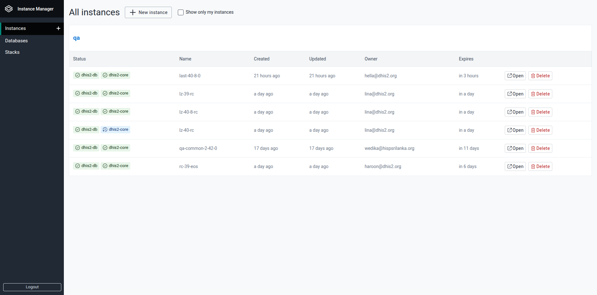

# Instance Manager User Guide

Welcome to the Instance Manager! This guide will help you get started and make the most of the application's features.

## Table of Contents

1. [Signing Up and Logging In](#signing-up-and-logging-in)
2. [Instances](#instances)
    - [Viewing Instances](#viewing-instances)
    - [Creating a New Instance](#creating-a-new-instance)
    - [Instance Details](#instance-details)
3. [Database](#databases)
4. [Troubleshooting & Support](#troubleshooting--support)

## Signing Up and Logging In

- **Login:**  
  
  Use your credentials to log in via the main page at im.dhis2.org

  

- **Sign Up:**  
  
  Visit `sign-up` on the login page to create a new account.  
  Enter your email, password, and confirm your password (minimum 24 characters!).  
  Submit the form to register.

  

  Once you have access you will need to be added to a group to be able to deploy instances and manage databases. Send a request to devops@dhis2.org to be added to a group, explaining why you need access.

- **Forgotten password?:**  
  
  Follow the `Forgot password?` link to request a reset.

## Instances

### Viewing Instances

- Access the list of all instances from the "Instances" section.
- Filter to show only your instances.
- See details like status, name, creation date, owner, and expiration.
- You can also click `Open` to go to the login page of a given instance, or `Delete` instances from here.

### Creating a New Instance

- Click the "New instance" button.
- Fill in the sections (see below), then hit the `Create instance` button.
  

#### Basic information

- Fill in the Basic information section:
  - **Name** of instance: must start with a letter and contain only letters, numbers or hyphens (`-`).
  - **Description** of the instance (optional).
  - **Make public**: currently only used to indicate "play" instances that are listed on the public landing page; but will be extended in the future to other groups that want to share public demos.
  - **Lifetime** - choose pre-selected durations or `Custom` end date. The instance and all of it's components (see below) will be deleted when the Lifetime expires.
  - **Group**: select the target group for this instance (when you belong to more than one).

#### Mandatory components

DHIS2 Core and DB are mandatory components of a DHIS2 isntance

##### DHIS2 Core

From the Image Repository you can select the type of DHIS2 build that you want to deploy: **Stable**; **Development**; **PR**.
You can then select an available image from that repository. 

> **Tip**
>
> The Image tag dropdown doesn't show the entire list of image tags available on DockerHub. If you don't see the version/build you are looking for try searching in the `Filter options` box.

*Advanced configuration*

This section can be expanded if you wish to tailor the environment that where the core is running.

The key parameters you *might* want to change (particularly for large, complex databases, or many users) are:

- Resources Requests CPU
- Resources Requests Memory
  

##### Database

Select one of the Databases you are managing in the [Database Manager](#databases)

*Advanced configuration*

This section can be expanded if you wish to tailor the environment that where the Postgresql database is running.

The key parameters you *might* want to change (particularly for large, complex databases, or many users) are:

- Database size: typically this needs to be about twice the size that the full database, with analytics, takes up on disc. *The additional space is required during analytics generation*.
- Resources Requests CPU
- Resources Requests Memory
  

##### PG Admin

If you wish to perform direct actions on the running Postgresql database, you can deploy PG Admin as part of your instance. 

Provide and email and password combination that will be used to log in to the PG Admin interface. *This doesn't have to be a real email account, it is just used as a login name, but it has to be in valid email format*.

### Instance Details

- From the main list of instances, click on an instance to view its details.
- This shows the components of the instance, and allows you to perform actions on those compnents.

##### Type dhis2-core

The following actions are available:

- Open: go to the login page of the instance.
- Logs: view the current tomcat logs.
- Restart: Restart the DHIS2 core - leaving the filestore intact
- Reset: Redeploy the docker container (pull new docker image if necessary) and clear the filestore.
- Delete: Remove the DHIS2 core docker container 

##### Type dhis2-db

The following actions are available:

- Logs: view the current tomcat logs.
- Save database as: Allows the state of the current running database to be saved to a file in the [Database Manager](#databases). 
- Restart: TBC
- Reset: Redeploy and re-seed the database from file.
- Delete: Remove the database container.

## Database { #databases }

Within this interface it is possible to:

- Browse databases organized by group and folder. 
- Actions include upload, download, copy, rename, and delete databases.
- The databases you have access to here are available when creating new instances.

> **Tip**
>
> Use `/` in database names to indicate path/folder structure for better organisation. The databases are currently only shown in list view, a folder view is planned in the future.

## Troubleshooting & Support

- If you encounter errors, check for error messages displayed in the app.
- For further help, contact the support team via the `#instance-manager-users` slack channel.

